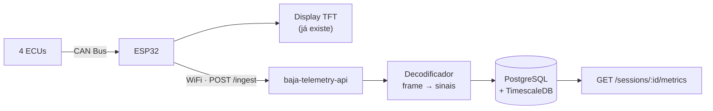

# baja-telemetry-api

> API de ingestão e consulta de telemetria da equipe **UnBaja SAE**.
> Recebe frames CAN do ESP32, decodifica em grandezas físicas e armazena em série temporal.

[]()
[]()
[]()
[]()

---

## O problema

Hoje o dado de telemetria nasce e morre no carro. As quatro ECUs conversam pelo barramento CAN,
o ESP32 lê, o display TFT mostra pro piloto — e acabou. Quando o carro volta pro box, ninguém
consegue responder:

- Em qual volta a temperatura do motor passou de 100 °C?
- O RPM caiu naquela curva, ou foi impressão do piloto?
- O consumo no teste de hoje foi melhor que o da semana passada?

O dado existe, passa pelo ESP32, e é descartado. **Este projeto é a peça que falta para ele parar
de ser descartado.**

## O que a API faz

Recebe, decodifica, armazena e devolve consultado aquilo que hoje só passa voando pelo display.



Tudo à esquerda do ESP32 já está construído pela equipe. Este repositório é o bloco novo.

## Sinais monitorados

| Sinal | Unidade | Taxa aproximada |
|---|---|---|
| RPM | rpm | 100 Hz |
| Temperatura do motor | °C | 10 Hz |
| Velocidade | km/h | 20 Hz |
| Nível de combustível | % | 1 Hz |
| GPS (lat/lon) | grau | 5 Hz |

Somando os quatro nós, a ordem de grandeza é de **~500 mensagens por segundo**.

## Stack

| Camada | Escolha | Motivo resumido |
|---|---|---|
| Linguagem | Kotlin 2.4 (JDK 25) | Null safety no compilador, interop total com o ecossistema Java |
| Framework | Spring Boot 4.1 | Padrão de mercado na JVM. Linha 4 por ser a estável atual — trade-off em `docs/11 §1.1` |
| Banco | PostgreSQL 17 + TimescaleDB | Série temporal com particionamento automático por tempo |
| Migrations | Flyway | Schema versionado em git, nunca `ddl-auto` |
| Testes | JUnit 5 + Testcontainers | Postgres real no teste, não banco em memória |
| Container | Docker (multi-stage) | Build Gradle → runtime JRE slim |
| CI/CD | GitHub Actions | Lint → testes → build de imagem |

As justificativas completas estão em [`docs/02-decisoes-tecnicas.md`](docs/02-decisoes-tecnicas.md).

## Documentação

| Documento | Conteúdo |
|---|---|
| 🚩 [**`docs/14-entendendo-o-projeto.md`**](docs/14-entendendo-o-projeto.md) | **Comece por aqui se não é do backend.** O que é cada peça e por que ela existe, do zero |
| 🚩 [**`docs/13-o-caminho-de-um-lote.md`**](docs/13-o-caminho-de-um-lote.md) | **Como as peças trabalham juntas** — o sistema inteiro em diagramas |
| [`docs/01-dominio-can.md`](docs/01-dominio-can.md) | O que é um frame CAN, como um byte cru vira grandeza física, o que é DBC |
| [`docs/02-decisoes-tecnicas.md`](docs/02-decisoes-tecnicas.md) | Decisões de arquitetura com justificativa (formato ADR) |
| [`docs/03-protocolo-ingestao.md`](docs/03-protocolo-ingestao.md) | Contrato entre o ESP32 e a API: lote, idempotência, dado fora de ordem |
| [`docs/04-glossario.md`](docs/04-glossario.md) | Jargão do domínio e da stack |
| [`docs/05-mapa-de-sinais.md`](docs/05-mapa-de-sinais.md) | O que é um DBC, por que existe, e como decodificar uma linha de sinal |
| [`docs/06-modelo-de-dados.md`](docs/06-modelo-de-dados.md) | Schema, hypertables e índices — com os números medidos de uma sessão real |
| [`docs/07-arquitetura-do-codigo.md`](docs/07-arquitetura-do-codigo.md) | Estrutura de pacotes e o fluxo de um `POST /ingest` passo a passo |
| [`docs/08-contrato-de-erros.md`](docs/08-contrato-de-erros.md) | **Para o firmware:** o catálogo de erros e quando retentar |
| [`docs/09-estrategia-de-testes.md`](docs/09-estrategia-de-testes.md) | Que nível testa o quê, e o teste de propriedade do decodificador |
| [`docs/10-requisitos-nao-funcionais.md`](docs/10-requisitos-nao-funcionais.md) | Números-alvo, cada um derivado ou medido |
| [`docs/11-ambiente-e-setup.md`](docs/11-ambiente-e-setup.md) | Versões fixadas, compose comentado, como rodar |
| [`docs/12-plano-de-fases.md`](docs/12-plano-de-fases.md) | **Mapa de progresso** — cada fase quebrada em checkpoints com critério de aceitação |

## Roadmap

Progresso detalhado, checkpoint a checkpoint, em [`docs/12-plano-de-fases.md`](docs/12-plano-de-fases.md).

- [x] **Fase 0 — Fundação documental.** Domínio, modelo de dados, arquitetura, contratos e requisitos decididos antes do código
- [x] **Fase 1 — Esqueleto.** Spring Boot + Kotlin, `POST /ingest`, Postgres via compose, primeiro teste com Testcontainers, gerador de dados sintéticos
- [x] **Fase 2 — Modelo de dados.** Flyway, hypertable, batch insert, decodificador de frame
- [ ] **Fase 3 — Consulta.** Agregação por janela de tempo, paginação por cursor
- [ ] **Fase 4 — Robustez.** API key, rate limiting, validação, Problem Details (RFC 7807), Actuator
- [ ] **Fase 5 — Deploy.** Dockerfile multi-stage, deploy gerenciado, teste de carga com número medido

## Como rodar

```bash
docker compose up -d                    # Postgres 17 + TimescaleDB
./gradlew bootRun                       # a API, na porta 8081
curl localhost:8081/actuator/health     # {"status":"UP"}

./gradlew test                          # 79 testes, com Postgres real
./gradlew gerador                       # telemetria sintética, sem o carro
```

Pré-requisitos e versões em [`docs/11`](docs/11-ambiente-e-setup.md).

## Equipe

Projeto da equipe [UnBaja SAE](https://github.com/UnBajaSAE) — Universidade de Brasília.
