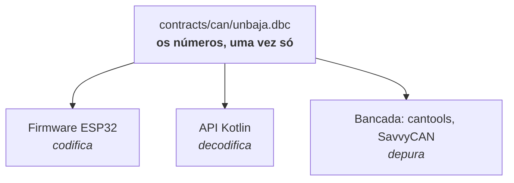
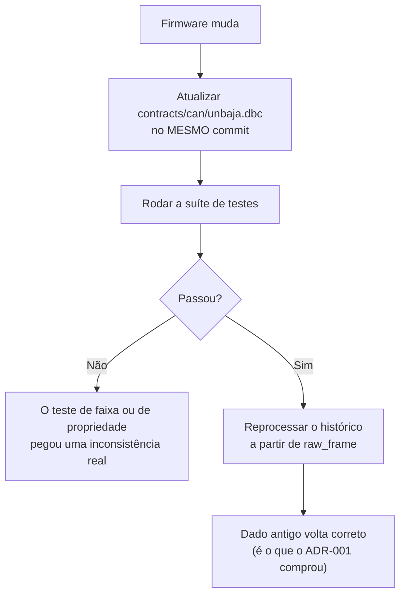

# 05 · O mapa de sinais (DBC)

Onde mora a resposta para *"o que significam estes 8 bytes?"*. É a fonte única de verdade do
decodificador — e hoje ela ainda está espalhada no firmware do ESP32.

| | |
|---|---|
| **Arquivo** | [`contracts/can/unbaja.dbc`](../contracts/can/unbaja.dbc) |
| **Estado** | ⚠️ **PROVISÓRIO** — valores fictícios, ver seção 5 |
| **Decisão** | [ADR-006](02-decisoes-tecnicas.md#adr-006--o-dbc-como-fonte-única-de-verdade) |

---

## 1. O problema que o DBC resolve

> Esta seção parte do zero. DBC não é conceito de CAN — é conceito de **ferramentaria
> automotiva**. Dá para trabalhar anos com CAN em firmware sem nunca ver um.

### 1.1 O mapa já existe, escrito em C

Hoje, para transmitir o RPM, o firmware faz algo assim:

```c
#define RPM_ESCALA  0.25f

void enviar_motor(float rpm, int temp_c) {
    uint16_t rpm_cru  = (uint16_t)(rpm / RPM_ESCALA);
    uint8_t  temp_cru = (uint8_t)(temp_c + 40);

    payload[0] = rpm_cru >> 8;      // byte alto primeiro
    payload[1] = rpm_cru & 0xFF;
    payload[2] = temp_cru;
    twai_transmit(...);
}
```

Estão embutidos aí **sete fatos**: o RPM mora nos bytes 0 e 1; tem 16 bits; byte alto primeiro;
é sem sinal; escala 0,25; a temperatura mora no byte 2; o offset dela é −40.

**Esses sete fatos são o mapa de sinais.** Ele já existe — só está escrito em C e grudado na
lógica de transmissão.

### 1.2 A API precisa dos mesmos sete fatos, ao contrário

Para `3E 80 5B` voltar a ser "4.000 rpm, 51 °C", a API executa o espelho:

```kotlin
val rpmCru = (payload[0].toInt() shl 8) or payload[1].toInt()
val rpm = rpmCru * 0.25
```

O `shl 8` é o fato 3. O `0.25` é o fato 5. **Os mesmos números, redigitados noutra linguagem.**

### 1.3 Dois donos da mesma verdade

Passam a existir duas cópias dos mesmos números, em dois repositórios, mantidas por duas pessoas
— possivelmente em dois semestres diferentes.

Troca-se o sensor, ajusta-se `RPM_ESCALA` para `0.125` no firmware, ninguém avisa o backend. A
API segue multiplicando por 0,25 e **grava o dobro do RPM real, sem levantar erro nenhum.**
O gráfico fica plausível e mentiroso — o modo de falha mais caro deste projeto.

No firmware isso já é resolvido: transmissor e receptor dão `#include "can_defs.h"`, e há um dono
só. **Mas a API não pode incluir um header C** — ela é Kotlin, noutro repositório, noutra máquina.

### 1.4 A ideia: tirar os números de dentro do código

O DBC é exatamente isso — os sete fatos extraídos para um arquivo de **dados**, que qualquer
linguagem consegue ler:

```
SG_ rpm : 7|16@0+ (0.25,0) [0|8000] "rpm" TELEMETRIA
     │     │  │ ││    │  │    │   │
     │     │  │ ││    │  │    └───┴── faixa física válida
     │     │  │ ││    └──┴─────────── escala e offset
     │     │  │ │└──────────────────  + = unsigned (− = signed)
     │     │  │ └───────────────────  @0 = big endian (@1 = little)
     │     │  └─────────────────────  largura em bits
     │     └────────────────────────  bit inicial
     └──────────────────────────────  nome do sinal
```

**O DBC é o `can_defs.h` num formato que o C, o Kotlin e o analisador de barramento leem igual.**

Ele não é protocolo: não trafega no fio, e o carro não sabe que existe. É um arquivo de texto
versionado no repositório. O formato foi criado pela Vector e virou padrão de fato — é por isso
que SavvyCAN, CANalyzer, BusMaster e `cantools` abrem o mesmo arquivo. Um formato próprio (YAML,
JSON) funcionaria, mas jogaria fora exatamente isso; o trade-off completo está no ADR-006.



> **O ganho existe mesmo sem esta API.** Consolidar o mapa num arquivo versionado resolve um
> problema que a equipe de eletrônica já tem hoje, independente do backend.

---

## 2. Por que o arquivo fica em `contracts/` e não em `src/`

Pelo diagrama acima: o backend é **um dos três consumidores**, não o dono. Enterrar o arquivo em
`src/main/resources/` sinalizaria que ele pertence à API.

Em `contracts/`, ao lado do `openapi.yaml`, fica explícito que mexer ali quebra outra pessoa. O
build da Fase 2 copia o arquivo para o classpath.

---

## 3. Como ler uma linha de sinal

A definição de um frame tem duas partes: a mensagem (`BO_`) e um sinal (`SG_`) por grandeza.

```
BO_ 256 MOTOR: 8 ECU_MOTOR
 SG_ rpm : 7|16@0+ (0.25,0) [0|8000] "rpm" TELEMETRIA
```

A linha `BO_` (*Board Object* — a mensagem):

| Trecho | Significado |
|---|---|
| `256` | Identificador CAN **em decimal** (`0x100`). O DBC nunca usa hexadecimal aqui |
| `MOTOR` | Nome da mensagem |
| `8` | DLC — quantos bytes o frame carrega |
| `ECU_MOTOR` | Nó que transmite |

A linha `SG_` (*Signal*):

| Trecho | Significado |
|---|---|
| `rpm` | Nome do sinal — vira o identificador consultável na API |
| `7` | Bit inicial (ver seção 4, é a parte traiçoeira) |
| `16` | Largura em bits |
| `@0` | Byte order: `@0` = big endian (Motorola), `@1` = little endian (Intel) |
| `+` | Sinal: `+` = unsigned, `-` = signed em complemento de dois |
| `(0.25,0)` | Escala e offset — a fórmula `físico = (cru × escala) + offset` |
| `[0\|8000]` | Faixa física válida, mínimo e máximo |
| `"rpm"` | Unidade |
| `TELEMETRIA` | Nó que consome |

> **A faixa não é comentário.** `[0|8000]` é validação executável: um sensor desconectado manda
> `0xFF` em tudo, o que sairia como 16.383 rpm. Fora da faixa, o ponto é marcado inválido —
> não descartado, porque saber que o sensor caiu também é informação.

---

## 4. A numeração de bits, que é onde todo mundo erra

Esta seção existe porque errar aqui **não gera exceção — gera um número plausível e errado**.

### 4.1 A grade de posições

Cada bit do payload tem uma posição global: `posição = índice_do_byte × 8 + índice_dentro_do_byte`,
com o bit 0 sendo o **menos** significativo de cada byte. Nos dois primeiros bytes:

```
              bit dentro do byte
           7   6   5   4   3   2   1   0
         +---+---+---+---+---+---+---+---+
byte 0   | 7 | 6 | 5 | 4 | 3 | 2 | 1 | 0 |
         +---+---+---+---+---+---+---+---+
byte 1   |15 |14 |13 |12 |11 |10 | 9 | 8 |
         +---+---+---+---+---+---+---+---+
```

### 4.2 O bit inicial significa coisas diferentes conforme a endianness

**Este é o ponto.** O campo "bit inicial" não é "onde o sinal começa fisicamente" — é **onde
está a ponta de referência**, e qual ponta depende do byte order:

| Endianness | O bit inicial aponta | Direção de leitura |
|---|---|---|
| `@0` big endian | O bit **mais** significativo do sinal | Decresce no byte; ao esgotar, salta pro bit 7 do byte seguinte |
| `@1` little endian | O bit **menos** significativo do sinal | Cresce em posição global |

Por isso o RPM de 16 bits ocupando os bytes 0 e 1 se escreve `7|16@0+` e **não** `0|16@0+`:
o MSB dele é o bit 7 do byte 0 — o mesmo bit que no firmware você escreve com `rpm_cru >> 8`.

### 4.3 Verificado, não deduzido

Saída real do `cantools` sobre o nosso arquivo, para o frame `0x100`:

```
             7   6   5   4   3   2   1   0
           +---+---+---+---+---+---+---+---+
         0 |<------------------------------|
           +---+---+---+---+---+---+---+---+
         1 |------------------------------x|
           +---+---+---+---+---+---+---+---+
                                         +-- rpm
```

O `<` marca o MSB, o `x` marca o LSB. O sinal começa em cima à esquerda e termina embaixo à
direita — exatamente o percurso da tabela acima.

E a prova numérica, com o payload de exemplo do [`docs/01`](01-dominio-can.md):

| Notação | `3E 80 5B` decodifica para |
|---|---|
| `7\|16@0+` (correta) | **4.000 rpm** ✅ |
| `0\|16@1+` (endianness trocada) | 8.207,5 rpm ❌ |

Nenhuma das duas gera erro. É por isso que o decodificador precisa de teste de propriedade, e
não só de inspeção visual.

---

## 5. Estado do levantamento

O arquivo atual é **fictício**. Ele existe para destravar o desenvolvimento — decodificador,
testes e gerador sintético podem ser construídos contra ele, e trocar o conteúdo depois **não
gera retrabalho**, porque o DBC é dado de entrada, não código.

Os três frames não foram escolhidos ao acaso: cada um materializa uma das armadilhas do
[`docs/01 §4`](01-dominio-can.md), para que o decodificador nasça com teste para todas.

| Frame | Sinais | Armadilha que exercita | Estado |
|---|---|---|---|
| `0x100` MOTOR | `rpm`, `temp` | Caso base — alinhado a byte, unsigned, big endian | 🔴 fictício |
| `0x200` DINAMICA | `speed` (12 b), `gear` (4 b) | **Sinal que cruza fronteira de byte** + little endian | 🔴 fictício |
| `0x300` GPS | `lat`, `lon` (32 b) | **Signed em complemento de dois** + escala fracionária | 🔴 fictício |

### 5.1 O que levantar do firmware

Para **cada sinal** de **cada frame** em uso, uma linha desta tabela. Preencha e o Claude
converte para DBC:

| Frame (hex) | ECU que envia | Sinal | Bit inicial | Largura | Endianness | Signed? | Escala | Offset | Mín | Máx | Unidade |
|---|---|---|---|---|---|---|---|---|---|---|---|
| `0x100` | `ECU_MOTOR` | `rpm` | 0 | 16 | big | não | 0.25 | 0 | 0 | 8000 | rpm |
| | | | | | | | | | | | |

> **Atenção ao preencher o "bit inicial":** informe onde o sinal está **no seu firmware**, do
> jeito que você pensa nele, e diga qual convenção usou. A conversão para a numeração DBC da
> seção 4 é mecânica e o Claude faz — mas só se souber a convenção de origem. Um bit inicial
> traduzido errado é justamente o bug que não dá exceção.

Onde procurar no firmware: os `#define` de máscara e deslocamento, os `struct` com campos de bit
(`uint16_t rpm : 12;`), e a função que monta o payload antes do `twai_transmit()`.

### 5.2 Fora de escopo do parser v1

O DBC tem diretivas que **não** são suportadas. ✅ **Implementado no checkpoint 2.3** — o parser
**falha alto** ao encontrar qualquer uma delas, com o número da linha e o conteúdo na mensagem,
e a aplicação não sobe:

- `VAL_` — tabelas de enumeração (ex.: `gear`: 0 = neutro, 1 = primeira). O valor numérico basta por ora
- `SG_MUL_VAL_` / multiplexação — um frame cujo conteúdo muda conforme um campo seletor
- `BA_` — atributos customizados, incluindo ciclo de transmissão
- Frames CAN FD (DLC acima de 8) e identificadores estendidos de 29 bits

> O bloco `NS_` no topo do arquivo **lista** os nomes dessas diretivas como símbolos que o formato
> conhece. O parser pula esse bloco de propósito: um parser ingênuo que falhasse ao "ver `VAL_`"
> recusaria o próprio cabeçalho.

---

## 6. Procedimento de mudança

Mudou o sensor, a escala ou o layout do frame no firmware? A sequência é esta, e a ordem importa:



**O passo que se esquece é o último.** Sem reprocessar, o banco fica com dado decodificado por
duas versões diferentes do mapa e ninguém consegue dizer qual é qual — motivo pelo qual o
modelo de dados guarda a versão do DBC junto com o ponto ([`docs/06`](06-modelo-de-dados.md)).

### 6.1 Como validar uma alteração

```bash
# valida a sintaxe e mostra o layout de bits de cada frame
pipx run cantools dump contracts/can/unbaja.dbc
```

`cantools` é ferramenta de bancada, **não** dependência do projeto — roda em venv efêmero e
serve de segunda opinião independente do nosso próprio parser. Se os dois discordarem, um dos
dois está errado, e é exatamente isso que se quer descobrir cedo.

**A comparação está automatizada.** O `FrameEncoderTest` monta frames com os sinais que o **nosso**
parser leu do arquivo, e compara byte a byte com a saída que o `cantools` produziu lendo o **mesmo**
arquivo. São duas leituras independentes confrontadas: uma divergência de escala, de bit inicial ou
de endianness aparece ali.
