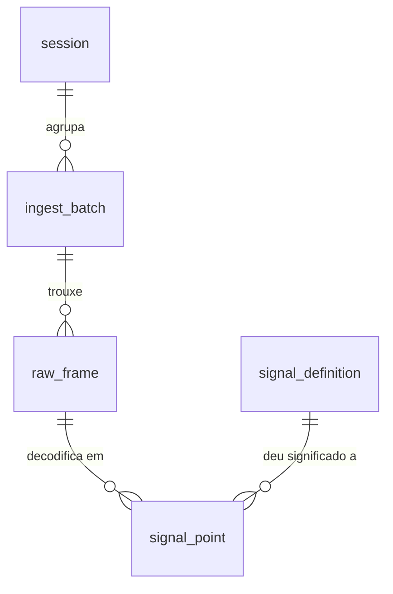

# 06 · Modelo de dados

Como o que chega pela rede vira linha no banco. É o documento que fecha a Fase 0 do lado dos
dados — o DDL daqui vira migration Flyway na Fase 2.

> **Ainda não é código.** As migrations são escritas na Fase 2. Aqui está o schema alvo e,
> mais importante, **o porquê de cada escolha**.

---

## 1. Panorama

Cinco tabelas. Duas delas são hypertables — as que crescem para dezenas de milhões de linhas.



| Tabela | Papel | Cresce quanto | Hypertable? |
|---|---|---|---|
| `session` | Um teste, uma prova, uma bateria | dezenas de linhas | não |
| `ingest_batch` | Um lote recebido do ESP32 | milhares | não |
| `raw_frame` | O frame cru, **imutável** | **dezenas de milhões** | **sim** |
| `signal_point` | O sinal decodificado, **descartável** | **centenas de milhões** | **sim** |
| `signal_definition` | Snapshot do DBC vigente | dezenas | não |

A assimetria do `docs/01 §2` aparece aqui: **1.000 frames viram ~2.500 pontos de sinal**, porque
cada frame carrega vários sinais. `signal_point` é sempre a maior tabela.

---

## 2. Os dois relógios

O conceito que mais influencia este schema, e que vem direto do ADR-004.

| Coluna | Quem marcou | Confiável? | Para que serve |
|---|---|---|---|
| `frame_time` | O ESP32, ao ler do barramento | **não** — tem deriva e reinicia | É a **verdade física**: quando o fenômeno aconteceu |
| `received_at` | O servidor, ao receber o lote | sim | Referência para corrigir a deriva depois |

Eles podem estar separados por **dez minutos**, se o carro rodou fora do alcance do WiFi e só
despejou o buffer no box. Isso não é anomalia — é o modo normal de operação.

**Guardo os dois.** Descartar o do servidor tira a única âncora confiável para corrigir o relógio
do dispositivo; descartar o do dispositivo destrói a informação temporal real, porque a ordem de
chegada não é a ordem dos acontecimentos.

**O particionamento usa `frame_time`**, não `received_at` — porque toda pergunta interessante é
sobre quando as coisas aconteceram no carro, não sobre quando o WiFi voltou.

---

## 3. As tabelas

### 3.1 `session`

```sql
CREATE TABLE session (
    id           TEXT PRIMARY KEY,
    description  TEXT,
    created_at   TIMESTAMPTZ NOT NULL DEFAULT now()
);
```

**`id` é `TEXT` e não `UUID`** porque quem gera é o dispositivo (ADR-007), no formato
`2026-08-24-teste-suspensao`. Um UUID seria garantidamente único, mas ilegível — e o valor de
poder olhar a lista de sessões e entender o que é cada uma, sem consultar outra tabela, ganha
aqui. O custo aceito é que um erro de digitação cria uma sessão fantasma.

**Não há `started_at` nem `ended_at` aqui.** Elas existiram no rascunho da Fase 0 como colunas
derivadas, e foram **removidas na V5**: mantê-las exigiria um `UPDATE` na linha da sessão a cada
lote, e o [checkpoint 2.6](12-plano-de-fases.md) provou que disputar a mesma linha serializa
requisições concorrentes. A duração agora é agregada da `ingest_batch` — ver
[ADR-011](02-decisoes-tecnicas.md) e a §3.2.

### 3.2 `ingest_batch`

```sql
CREATE TABLE ingest_batch (
    id           UUID PRIMARY KEY,
    session_id   TEXT NOT NULL REFERENCES session(id),
    device_id    TEXT NOT NULL,
    frame_count     INTEGER NOT NULL,
    rejected_count  INTEGER NOT NULL DEFAULT 0,
    received_at     TIMESTAMPTZ NOT NULL DEFAULT now(),
    decoded_at      TIMESTAMPTZ,
    -- Menor e maior frame_time DESTE lote (ADR-011)
    first_frame_at  TIMESTAMPTZ,
    last_frame_at   TIMESTAMPTZ
);

CREATE INDEX idx_batch_session        ON ingest_batch (session_id, received_at DESC);
CREATE INDEX idx_batch_sessao_inicio  ON ingest_batch (session_id, first_frame_at);
```

**Esta tabela é a idempotência inteira** (ADR-008). O `id` é o `batchId` que o ESP32 gerou. Lote
que chega com um `id` já existente é reconhecido e ignorado — e é o `PRIMARY KEY` que garante
isso, no banco, e não uma verificação no código que duas requisições simultâneas driblariam.

**`rejected_count` torna auditável a perda aceita pelo [ADR-010](02-decisoes-tecnicas.md).** Um
lote pode entrar com frames inválidos descartados; se esse número subir numa sessão, o problema é
físico — cartão SD ruim, alimentação instável — e o gráfico de rejeições é o que denuncia.

**`first_frame_at` e `last_frame_at` são o que torna o `GET /sessions` barato.** Cada lote grava
o próprio mínimo e máximo na linha que já estava sendo inserida — zero contenção — e a listagem
agrega sobre milhares de linhas em vez de milhões. Medido com 2,2 M frames: **1,5 ms** contra
**220 ms** varrendo a `raw_frame` ([ADR-011](02-decisoes-tecnicas.md)).

**`decoded_at` nulo significa "cru gravado, sinais ainda não"** — o que permite reprocessar sem
adivinhar o que já foi feito, e sobreviver a um crash no meio do processamento.

### 3.3 `raw_frame` — a fonte da verdade

```sql
CREATE TABLE raw_frame (
    frame_time   TIMESTAMPTZ NOT NULL,
    session_id   TEXT NOT NULL,
    device_id    TEXT NOT NULL,
    can_id       INTEGER NOT NULL,
    payload      BYTEA NOT NULL,
    batch_id     UUID NOT NULL,
    received_at  TIMESTAMPTZ NOT NULL
);

SELECT create_hypertable('raw_frame', 'frame_time',
                         chunk_time_interval => INTERVAL '1 day');

CREATE INDEX idx_raw_session_time ON raw_frame (session_id, frame_time DESC);
CREATE INDEX idx_raw_batch        ON raw_frame (batch_id);
```

Append-only e **imutável**: nada nesta tabela é atualizado ou apagado. É o que o ADR-001 comprou
— descobrir em novembro que a escala estava errada desde agosto deixa de ser perda de temporada.

**`payload` é `BYTEA` e não `BIGINT`.** Oito bytes cabem num `BIGINT`, que seria mais compacto.
Descartado porque perde o DLC: um payload de 3 bytes e outro de 8 com cinco zeros à esquerda
viram o mesmo número, e a informação de quantos bytes o frame carregava se perde.

**`payload` não é decodificado aqui.** Guardar `rpm` nesta tabela seria misturar o cru com o
derivado, e acabar com a capacidade de reprocessar.

### 3.4 `signal_point` — o derivado consultável

```sql
CREATE TABLE signal_point (
    ts           TIMESTAMPTZ NOT NULL,
    session_id   TEXT NOT NULL,
    signal_name  TEXT NOT NULL,
    value        DOUBLE PRECISION NOT NULL,
    is_valid     BOOLEAN NOT NULL DEFAULT TRUE,
    can_id       INTEGER NOT NULL,
    dbc_version  TEXT NOT NULL
);

SELECT create_hypertable('signal_point', 'ts',
                         chunk_time_interval => INTERVAL '1 day');

CREATE INDEX idx_signal_query ON signal_point (session_id, signal_name, ts DESC);
```

**`is_valid` existe por causa da faixa do DBC.** Sensor desconectado manda `0xFF` em tudo, o que
sai como 16.383 rpm. O ponto é gravado e **marcado inválido**, não descartado — porque saber que
o sensor caiu às 14h32 também é informação, e um buraco no gráfico não distingue "sensor morreu"
de "carro parado".

**`dbc_version` responde "com que mapa este número foi calculado?".** Sem ela, depois de corrigir
uma escala o banco fica com pontos decodificados por duas versões diferentes e ninguém consegue
dizer qual é qual. É a coluna que torna o reprocessamento do ADR-001 auditável.

**`signal_name` é `TEXT` repetido centenas de milhões de vezes** — o que parece desperdício. A
alternativa é uma tabela de códigos e um `SMALLINT` aqui. Fica como `TEXT` na Fase 2 porque a
compressão do TimescaleDB é excelente justamente com valores repetidos, e porque consulta
legível sem JOIN vale muito enquanto o projeto é pequeno. **Revisar com o número medido na
Fase 5**, não por antecipação.

> **Medido depois:** este índice rende menos do que se esperava — 1,4× na agregação de sessão
> inteira, porque o TimescaleDB já cria um índice em `ts` sozinho. Quem resolve aquele caso é o
> agregado contínuo, não o índice. Ver [`docs/10 §2.3`](10-requisitos-nao-funcionais.md).

**A ordem do índice não é arbitrária:** `(session_id, signal_name, ts DESC)` atende
`WHERE session_id = ? AND signal_name = ? AND ts BETWEEN ? AND ?`, que é literalmente o
`GET /sessions/{id}/metrics`. Um índice em `(ts, session_id, signal_name)` existiria, ocuparia o
mesmo espaço e não serviria para essa consulta — a coluna mais seletiva vem primeiro.

### 3.5 `signal_definition`

```sql
CREATE TABLE signal_definition (
    dbc_version   TEXT     NOT NULL,
    can_id        INTEGER  NOT NULL,
    signal_name   TEXT     NOT NULL,
    start_bit     SMALLINT NOT NULL,
    bit_length    SMALLINT NOT NULL,
    byte_order    TEXT     NOT NULL CHECK (byte_order IN ('BIG', 'LITTLE')),
    is_signed     BOOLEAN  NOT NULL,
    scale         DOUBLE PRECISION NOT NULL,
    offset_value  DOUBLE PRECISION NOT NULL,
    min_value     DOUBLE PRECISION,
    max_value     DOUBLE PRECISION,
    unit          TEXT,
    PRIMARY KEY (dbc_version, can_id, signal_name)
);
```

O conteúdo do DBC, gravado a cada subida da aplicação. **O arquivo continua sendo a fonte de
verdade** (ADR-006); esta tabela é o registro histórico de qual mapa estava vigente quando.

**`offset_value` e não `offset`:** `OFFSET` é palavra reservada no SQL (a de `LIMIT ... OFFSET`).
Usá-la como nome de coluna obrigaria a escrever `"offset"` com aspas em toda consulta, para
sempre. Renomear uma vez é mais barato.

---

## 4. As três surpresas do TimescaleDB

Coisas que quebram quem chega do Postgres comum.

### 4.1 Hypertable não aceita chave primária simples

O reflexo seria dar `id BIGSERIAL PRIMARY KEY` ao `raw_frame`. **Não funciona.**

Regra: **todo índice único numa hypertable precisa incluir a coluna de particionamento.**
O motivo é físico — por baixo, os chunks são tabelas separadas, e o Postgres não consegue
garantir unicidade *entre* tabelas diferentes sem saber em qual procurar.

O erro é explícito:

```
ERROR:  cannot create a unique index without the column "ts" (used in partitioning)
HINT:   If you're creating a hypertable on a table with a primary key, ensure the
        partitioning column is part of the primary or composite key.
```

Decisão aqui: **`raw_frame` e `signal_point` não têm chave primária.** São append-only e a
unicidade é garantida no nível do lote, na `ingest_batch` (ADR-008). Chave primária ali seria
custo de índice sem função.

### 4.2 Chave estrangeira em hypertable custa caro na inserção

`raw_frame.batch_id` referenciando `ingest_batch(id)` é permitido — mas cada linha inserida paga
uma verificação. **Num lote de 5.000 frames, são 5.000 verificações.**

Decisão: **sem `REFERENCES` na `raw_frame`**, com a integridade garantida pela aplicação (o lote
é gravado antes dos frames, na mesma transação). O `idx_raw_batch` continua permitindo o JOIN.
É uma troca consciente de garantia declarativa por velocidade de escrita, no único lugar do
schema onde a taxa de escrita importa — e o motivo de existir está escrito aqui, que é o que
separa isso de esquecimento.

### 4.3 O tamanho do chunk é decisão sua

Uma janela grande demais e cada chunk vira uma tabela gigante — perde-se o ganho. Pequena demais
e uma consulta de uma hora abre centenas de chunks, cada um com seu custo.

**Escolha: 1 dia.** O raciocínio vem do domínio, não de uma fórmula: **uma sessão de teste cabe
num dia.** Medido no [§8.2](#82-o-que-cabe-num-chunk): 2 h de pista geram exatamente um chunk
por tabela. Como toda consulta é escopada por sessão, uma janela diária faz a consulta típica
tocar exatamente um chunk. A regra de bolso do Timescale (um chunk deve caber com folga na
memória) também é satisfeita: mesmo uma prova de enduro de 4 h gera ~7,2 milhões de frames, na
casa das centenas de MB.

Revisar se as sessões passarem a cruzar a meia-noite, ou se a taxa de amostragem subir.

> ⚠️ **Descoberto ao implementar (checkpoint 2.2): a meia-noite que importa é a de UTC.** O
> TimescaleDB alinha as fronteiras de chunk em UTC, não no fuso local. Em Brasília (−03) isso cai
> às **21h locais** — então uma bateria noturna que atravesse esse horário ocupa dois chunks em
> vez de um.
>
> Não quebra nada: a consulta abre dois chunks e responde igual, só rende um pouco menos. Mas o
> raciocínio "uma sessão cabe num dia" da seção acima vale para o dia **UTC**, e é bom saber disso
> antes de estranhar o número de chunks. Consultas a `timescaledb_information.chunks` precisam
> converter explicitamente (`range_start AT TIME ZONE 'UTC'`), senão a data exibida vem deslocada.

---

## 5. Compressão e retenção

```sql
ALTER TABLE raw_frame SET (
    timescaledb.compress,
    timescaledb.compress_segmentby = 'session_id, can_id',
    timescaledb.compress_orderby   = 'frame_time DESC'
);

SELECT add_compression_policy('raw_frame', INTERVAL '30 days');
```

`segmentby` agrupa fisicamente as linhas que compartilham `session_id` e `can_id`, e é aí que a
compressão fica boa: dentro de um grupo desses, os valores se repetem muito.

**A política de retenção tem uma inversão que vale notar.** O instinto é apagar o dado velho e
volumoso — que é o `raw_frame`. Mas ele é justamente o que **não pode** ser apagado: é a fonte da
verdade, e apagá-lo elimina a capacidade de reprocessar que o ADR-001 comprou.

| Tabela | Retenção | Por quê |
|---|---|---|
| `raw_frame` | **nunca apagar**, só comprimir | Insubstituível. É a origem |
| `signal_point` | pode apagar | Reconstruível a partir do cru |

Cru comprimido e derivado descartável — o oposto do instinto, e a consequência direta do ADR-001.

---

## 6. O que fica para depois

**Agregado contínuo** (`CREATE MATERIALIZED VIEW ... WITH (timescaledb.continuous)`) mantém médias
por janela pré-calculadas, atualizadas sozinhas.

✅ **Implementado no checkpoint 3.2** (migration V6), e antes do previsto: o plano o colocava no
3.3, mas o **resumo** já o exigia — 3.658 ms agregando `signal_point` direto, contra meta de
200 ms. Com ele, ~70 ms.

Duas escolhas de desenho valem registro, e estão no [ADR-012](02-decisoes-tecnicas.md): ele guarda
**soma e contagem**, nunca `avg()` (senão quem consulta tira média das médias, que só dá certo com
janelas uniformes); e a **agregação em tempo real é ligada explicitamente**, porque o padrão do
TimescaleDB mudou para desligada e dado recém-gravado ficaria invisível por até um minuto.

**Tabela `device`** com chave de API por dispositivo entra na Fase 4. Hoje `device_id` é texto
solto; virar chave estrangeira depois é uma migration simples.

---

## 7. Aceite — verificado, não deduzido

Todo o DDL acima foi extraído deste documento e executado num container
`timescale/timescaledb:latest-pg16` descartável. As duas hypertables foram criadas e a política
de compressão registrada, sem erro.

Inserindo frames espalhados por três dias, os chunks nascem sozinhos, um por dia:

```
    chunk_name    |     de     |    ate
------------------+------------+------------
 _hyper_1_1_chunk | 2026-08-22 | 2026-08-23
 _hyper_1_2_chunk | 2026-08-23 | 2026-08-24
 _hyper_1_3_chunk | 2026-08-24 | 2026-08-25
```

E o plano de uma consulta escopada a um dia toca **um único chunk** — os outros dois são
descartados antes da execução:

```
 Aggregate
   ->  Bitmap Heap Scan on _hyper_1_3_chunk
         ->  Bitmap Index Scan on _hyper_1_3_chunk_idx_raw_session_time
```

É este plano que separa varrer 200 mil linhas de varrer 18 milhões — e é o motivo de existir o
ADR-002.

- [x] O DDL roda num TimescaleDB real, sem erro
- [x] `create_hypertable` aceita as duas tabelas de série temporal
- [x] Os chunks aparecem em `timescaledb_information.chunks` após inserção
- [x] O planejador poda os chunks irrelevantes
- [x] `offset_value` evita a palavra reservada
- [x] Toda coluna tem justificativa escrita

---

## 8. Anexo — um sábado de testes, medido de ponta a ponta

Todos os números desta seção foram medidos num TimescaleDB real, com 2 h de sessão simulada a
500 msg/s. Serve para responder concretamente: **o que tem dentro de um chunk?**

### 8.1 A linha do tempo

| Hora | O que acontece | O que o banco faz |
|---|---|---|
| 08:50 | ESP32 ligado. Monta `sessionId` e **grava no SD** | nada — ninguém falou com ele ainda |
| 09:00 | Carro entra na pista. ~500 frames/s no CAN | — |
| 09:00 | Ainda há WiFi do box. Primeiro lote entra | Olha o `frame_time` (22/08), **não acha a gaveta do dia, e cria**. Nasce o 1º chunk |
| 09:02 | Carro se afasta, **WiFi cai**. POST falha | — |
| 09:02–11:00 | Firmware lê e empilha no SD. Backoff. 3,6 M frames acumulam | nada chega |
| 11:00 | Carro volta ao box. Firmware **despeja o buffer** | Frames chegam às 11 h carregando `frame_time` de 9 h |
| 11:05 | Fim do envio | **Tudo cai no chunk do dia 22** — o mesmo criado às 09:00 |
| 11:06 | "Em que volta a temperatura passou de 100 °C?" | Abre **um** chunk. Os das outras semanas nem são tocados |
| +30 dias | Política de compressão dispara sozinha | 928 MB → 23 MB, ainda consultável |

> **O ponto que mais confunde:** o chunk **não** tem relação com o ESP32, com o cartão SD ou com
> o momento do upload. O firmware nunca ouve falar em chunk. O chunk é escolhido **por linha, no
> servidor, no momento do `INSERT`, olhando o `frame_time`**. Frames que chegam às 11 h com
> carimbo de 9 h vão para a gaveta das 9 h. É por isso que o particionamento usa `frame_time` e
> não `received_at` (§2), e por isso a inserção fora de ordem do ADR-004 é requisito e não detalhe.

### 8.2 O que cabe num chunk

Duas horas de pista, com o `chunk_time_interval` de 1 dia da §4.3:

| Tabela | Linhas | Total | Dados | Índices | Chunks |
|---|---|---|---|---|---|
| `raw_frame` | 3.600.000 | 928 MB | 402 MB | 526 MB | **1** |
| `signal_point` | 7.200.000 | 1.675 MB | 695 MB | 981 MB | **1** |

**Uma sessão inteira cabe em um chunk de cada tabela** — que era exatamente o objetivo ao
escolher a janela de 1 dia. Uma sessão que cruzasse a meia-noite geraria dois, e a consulta
abriria dois: não quebra nada, só rende menos.

### 8.3 Compressão: fator 40

```sql
SELECT compress_chunk(c) FROM show_chunks('raw_frame') c;
```

| Antes | Depois | Fator |
|---|---|---|
| 928 MB | **23 MB** | **40,3×** |

Funciona tão bem porque `compress_segmentby = 'session_id, can_id'` agrupa fisicamente linhas
que compartilham esses valores, e dentro de um grupo desses quase tudo se repete.

> **Ressalva honesta:** dado sintético comprime melhor que dado real — o payload gerado aqui é
> mais regular que telemetria de verdade. Tratar 40× como **teto**, e remedir na Fase 5 com dado
> do gerador sintético do ADR-005, que é mais realista.

### 8.4 Achado: os índices são maiores que os dados

Não estava previsto, e é o tipo de coisa que só aparece medindo:

```
idx_signal_query      731 MB   ← (session_id, signal_name, ts DESC)
idx_raw_session_time  365 MB   ← (session_id, frame_time DESC)
idx_raw_batch          22 MB   ← (batch_id)
```

A causa é o `session_id` — `TEXT` de 26 caracteres, replicado **dentro de cada índice**, uma vez
por linha. Em 7,2 milhões de linhas, o texto pesa mais que o dado que ele indexa.

**Isto é o gatilho da revisão prometida na §3.4.** As opções, para decidir na Fase 5 com o
gerador realista:

| Opção | Ganho | Custo |
|---|---|---|
| `session_id` vira `INTEGER` com tabela de referência | Índices caem para uma fração | JOIN em toda consulta; migration |
| `signal_name` vira `SMALLINT` com tabela de códigos | Idem, no maior índice | Consulta deixa de ser legível direto |
| Manter `TEXT` e comprimir mais cedo | Zero trabalho | Não ajuda o índice do dado quente |

Nenhuma delas se decide agora: 2,5 GB por sessão é perfeitamente administrável, e trocar chave
legível por chave numérica antes de saber que o tamanho incomoda seria otimização por
antecipação. **O que muda é que agora existe um número na mesa, e não uma intuição.**
