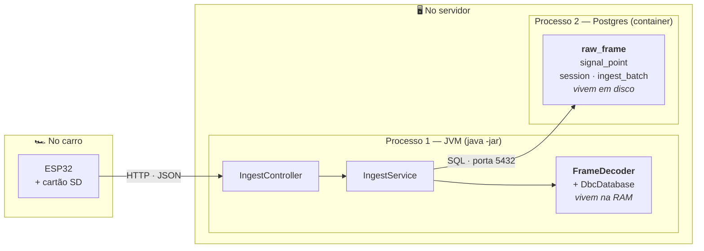

# 07 · Arquitetura do código

Onde cada arquivo mora e por quê. Decidido antes da primeira linha de Kotlin, para que a
estrutura seja escolha e não sedimento.

**Decisão:** [ADR-009](02-decisoes-tecnicas.md#adr-009--domínio-isolado-do-framework)

---

## 1. A regra que vale mais que a estrutura

> **O pacote `domain` não importa nada de Spring.**

Só isso. Se todo o resto for esquecido, essa regra sozinha entrega a maior parte do valor.

**Por quê.** É em `domain` que mora o decodificador, e o decodificador vai ser testado com
**teste de propriedade** — milhares de casos aleatórios verificando `decode(encode(x)) ≈ x`.

Um teste desses precisa rodar em milissegundos. Se a classe testada carregar uma anotação do
Spring, o teste passa a exigir contexto de aplicação: alguns segundos de bootstrap por execução.
A consequência não é o teste ficar lento — é ele **deixar de ser rodado**, e um teste que
ninguém roda não protege nada.

Há uma segunda razão, mais duradoura: o decodificador é a única parte deste projeto que é
**lógica de verdade**. O resto é encanamento — receber JSON, mandar SQL, devolver JSON. Isolar a
parte que pensa da parte que conecta é o que permite mexer numa sem medo de quebrar a outra.

E a regra é **executável**, não aspiracional — tem teste que falha se alguém violá-la (§6).

---

## 2. A árvore

```
br.unb.baja.telemetry
│
├── domain/                    ← ZERO import de Spring. Kotlin puro
│   ├── can/
│   │   ├── CanFrame.kt              frame cru: instante, canId, payload
│   │   ├── SignalDefinition.kt      bit inicial, largura, endianness, escala, faixa
│   │   ├── SignalValue.kt           resultado: nome, valor, válido?
│   │   ├── FrameDecoder.kt          ★ o coração — bits → grandeza física
│   │   └── dbc/
│   │       ├── DbcParser.kt         texto do .dbc → objetos
│   │       └── DbcDatabase.kt       mapa canId → sinais, já indexado
│   └── session/
│       ├── SessionId.kt             valida o formato AAAA-MM-DD-slug
│       └── IngestBatch.kt           lote de frames, já validado
│
├── application/               ← orquestra. Usa @Service e @Transactional
│   ├── IngestService.kt             o fluxo da §4
│   ├── QueryService.kt              consultas da Fase 3
│   └── port/
│       ├── RawFrameStore.kt         interface — o que a aplicação precisa
│       └── SignalPointStore.kt
│
├── adapter/
│   ├── web/                         entrada HTTP
│   │   ├── IngestController.kt
│   │   ├── dto/                     o JSON do contrato, separado do domínio
│   │   └── error/                   Problem Details (docs/08)
│   └── persistence/                 saída para o banco
│       ├── JdbcRawFrameStore.kt     implementa a interface acima
│       └── JdbcSignalPointStore.kt
│
├── config/                          beans, carga do DBC na subida
└── TelemetryApplication.kt
```

**Por que `application/port/` com interfaces**, em vez de o serviço chamar o repositório direto:
para testar o `IngestService` sem banco. A interface é declarada onde é **usada**, e implementada
no adaptador — uma indireção só, barata. Não é hexagonal completa; é o pedaço dela que se paga
aqui (ver §7).

**Por que `dto/` separado do domínio:** o JSON é contrato externo, e muda por razões externas
(versão da API, conveniência do firmware). Se o controller desserializasse direto para as classes
de domínio, toda mudança no formato do JSON viraria mudança no decodificador.

---

## 3. Onde cada coisa fisicamente está

Antes do fluxo, a geografia — sem ela o resto não faz sentido. São **duas máquinas**, e uma delas
roda **dois programas separados**.



| Pergunta | Resposta |
|---|---|
| Onde o `raw_frame` é guardado? | **Dentro do Postgres**, em disco. Não no cartão SD, não na memória da API |
| Onde o `FrameDecoder` roda? | **Dentro da JVM**, na RAM, usando a CPU do servidor |
| O decodificador conversa com o banco? | **Nunca.** Recebe bytes como argumento e devolve números. É uma conta |

Os dois processos do servidor conversam por rede (`localhost:5432`), mandando SQL — são tão
separados quanto se estivessem em prédios diferentes.

---

## 4. A história de um `POST /ingest`

Continuando o sábado do [`docs/06 §8`](06-modelo-de-dados.md). São **11:00:04**, o carro voltou ao
box, o WiFi reconectou, e o firmware está despejando o cartão. Este é o lote **1.847 de 3.600**.

**O ESP32 monta um pacote de texto.** Lê do cartão 1.000 frames gravados entre 09:52:14 e
09:52:16, e escreve um JSON com o `batchId` que gravou junto com eles, o `sessionId` e a lista de
frames. Dá 62 KB. Manda pela rede e **fica esperando** — não apaga nada do cartão ainda, porque
não sabe se chegou.

**O Tomcat recebe os 62 KB.** Ele é o servidor HTTP embutido no Spring Boot, e só sabe de bytes
chegando numa porta: não sabe o que é Baja, CAN ou banco. Vê a URL `/api/v1/ingest` e entrega
para o Spring resolver.

**O Spring chama o `IngestController`**, e antes de entregar, o Jackson transforma o texto JSON em
objetos Kotlin — o `IngestRequestDto`.

O DTO é classe separada, e não o objeto de domínio, **porque o JSON é contrato externo**: muda
quando o firmware muda, quando a versão da API muda. Se o Jackson desserializasse direto para as
classes de domínio, toda mudança de formato viraria mudança no decodificador. O DTO é zona de
amortecimento.

**O Controller confere a forma.** Mil frames (dentro do limite de 5.000), `sessionId` no padrão
`AAAA-MM-DD-slug`, cada payload com número par de dígitos hex e no máximo 8 bytes.

Repare no que ele **não** confere: se o `canId` 256 existe no DBC. Isso é pergunta de domínio, e o
Controller não fala domínio — fala HTTP. Ele verifica só o que dá para verificar olhando o texto.

**O Controller converte o DTO em `IngestBatch`** e chama o `IngestService`. Daqui para frente
ninguém mais sabe que existiu HTTP.

**O Service abre uma transação** — um "tudo ou nada". Tudo que for escrito daqui até o `COMMIT`
fica invisível para o resto do mundo, e se algo falhar no meio, **tudo é desfeito como se nunca
tivesse acontecido**. É o que garante que não sobre meio lote gravado.

**`INSERT` na `session`, com `ON CONFLICT DO NOTHING`.** A sessão existe desde o lote 1, então o
Postgres ignora. Isso é mais seguro que "consultar se existe, e criar se não existir": entre a
consulta e a criação, outro lote poderia ter criado a mesma sessão.

**`INSERT` na `ingest_batch` — e aqui é o momento decisivo.** O `batchId` é chave primária. Se
este lote já tiver sido processado (o WiFi caiu no meio da resposta e o firmware retentou), o
Postgres **recusa a inserção**; a API entende como "já vi este lote", responde `duplicate: true`
e encerra sem gravar nada duas vezes.

É restrição do banco, **não um `if` no código**, porque um `if (jaExiste)` teria uma fresta: duas
requisições simultâneas, ambas perguntando "existe?", ambas ouvindo "não", ambas gravando. Chave
primária não tem essa fresta.

**O `JdbcRawFrameStore` grava os 1.000 frames crus**, num comando só em vez de mil. **Este é o
passo mais importante da história: daqui para frente o dado está a salvo.** Mesmo que tudo depois
falhe, o cru está no Postgres — e o cru é o que não pode ser perdido. É o ADR-001 virando ordem
de execução.

**Só então o `FrameDecoder` entra.** Ele recebe um frame, procura no `DbcDatabase` (carregado na
RAM desde a subida da aplicação) quais sinais moram no `canId` 256, e para cada um extrai os bits,
aplica `(cru × escala) + offset` e confere a faixa. Mil frames viram ~2.500 sinais.

**Ele não abre transação, não manda SQL, não sabe que existe banco.** Entra byte, sai número. É
por isso que pode ser testado com dez mil casos aleatórios em milissegundos, sem subir nada — e é
exatamente essa a razão da regra da §1.

**O `JdbcSignalPointStore` grava os ~2.500 pontos**, também em lote. Os que caíram fora da faixa
do DBC entram com `is_valid = false` — gravados, não descartados, porque saber que o sensor caiu
às 09:52 também é informação.

**O Service marca `decoded_at = now()`.** Se o processo tivesse morrido no meio da decodificação,
essa coluna ficaria nula e o reprocessamento saberia exatamente o que refazer, sem adivinhar.

**`COMMIT`.** Tudo vira oficial de uma vez. E o Postgres, ao gravar cada linha, olha o
`frame_time` — 09:52 de 22/08 — e arquiva no chunk **daquele** dia, não no das 11h, que é quando
os dados chegaram. O banco não liga para a hora do relógio de parede: liga para o carimbo que a
linha carrega.

**O Controller responde `200 OK` com `framesStored: 1000`.**

**O ESP32, que esperava esse tempo todo, vê o 2xx e finalmente apaga aquele trecho do cartão** —
e começa a montar o lote 1.848. Repete 3.600 vezes.

### 4.1 O que essa história revela

**Cada camada ignora as vizinhas de propósito.** O Tomcat não sabe o que é CAN; o Controller não
sabe o que é chunk; o decodificador não sabe que existe banco; o ESP32 não sabe que existe
TimescaleDB. Essa ignorância é o projeto funcionando — é o que permite trocar uma peça sem tocar
nas outras.

**A ordem dos passos é a decisão de segurança.** Gravar o cru **antes** de decodificar não é
detalhe de implementação: é o que garante que uma falha no decodificador custe um reprocessamento,
e não a telemetria do dia.

## 5. Por que tudo numa transação só

Decidido: **decodificar dentro da mesma transação da gravação do cru.**

A alternativa era responder assim que o cru estivesse salvo (logo após o `JdbcRawFrameStore`) e decodificar em segundo
plano. Ela é legítima e tem um argumento real: o ESP32 liberaria o buffer mais cedo, o que
importa quando a memória dele é apertada.

Foi descartada **por ora** porque cobra caro em complexidade: exige máquina de retentativa,
monitoramento de fila, e cria uma janela em que a consulta não acha o sinal que acabou de ser
enviado — o clássico "mandei e não apareceu" que custa horas de depuração.

**A porta fica aberta.** A coluna `decoded_at` já existe no schema justamente para isso: migrar
para assíncrono depois é mudança de código, não migration de banco. A decisão se revisita se a
Fase 5 medir a latência do `/ingest` acima da meta do `docs/10`.

---

## 6. O teste que faz a regra valer

Uma regra de arquitetura que só existe em documento é uma sugestão. Esta vira teste:

```kotlin
@Test
fun `o dominio nao depende de framework nenhum`() {
    val classes = ClassFileImporter().importPackages("br.unb.baja.telemetry.domain")

    noClasses().should().dependOnClassesThat()
        .resideInAnyPackage("org.springframework..", "jakarta.persistence..", "com.fasterxml.jackson..")
        .check(classes)
}
```

Se alguém — inclusive o Claude, numa sessão futura — anotar uma classe de `domain` com
`@Component` por conveniência, **o build quebra** com a mensagem dizendo qual classe e qual
importação. É o mesmo princípio da faixa válida no DBC: transformar documentação em validação
executável.

Custa uma dependência de teste (ArchUnit) e um arquivo.

---

## 7. O que deliberadamente não foi feito

**Hexagonal completa (ports & adapters).** Portas de entrada e de saída, adaptadores dos dois
lados, o serviço atrás de uma interface de caso de uso. Academicamente mais correta.

Descartada porque a cerimônia não se paga num projeto de cinco endpoints: cada operação passaria
por três arquivos, e a resposta honesta a *"por que essa indireção existe?"* seria "porque o
padrão manda" — que é a pior resposta possível numa entrevista.

O que se manteve dela foi **a única parte que se paga**: a inversão entre `application` e
`persistence`, que existe para poder testar o serviço sem banco, e o isolamento do domínio, que
existe para poder testar o decodificador em milissegundos. **Cada indireção deste projeto tem um
teste que a justifica.**

**Package-by-layer** (`controller/`, `service/`, `repository/`) também foi descartado. É o que
todo tutorial de Spring mostra, e qualquer dev Java reconhece de imediato — mas colocaria o
`FrameDecoder` dentro de `service/`, junto de classes anotadas, e a regra da §1 morreria no
primeiro dia.
