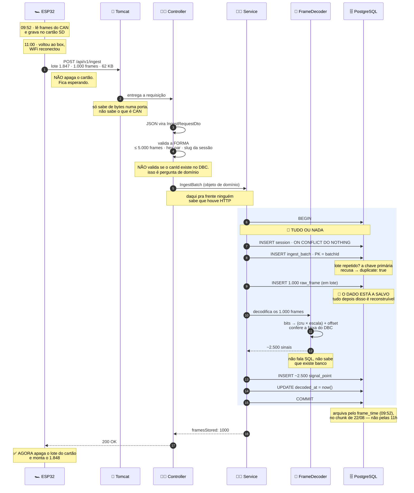
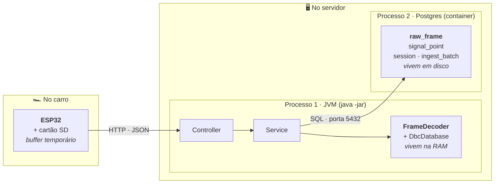
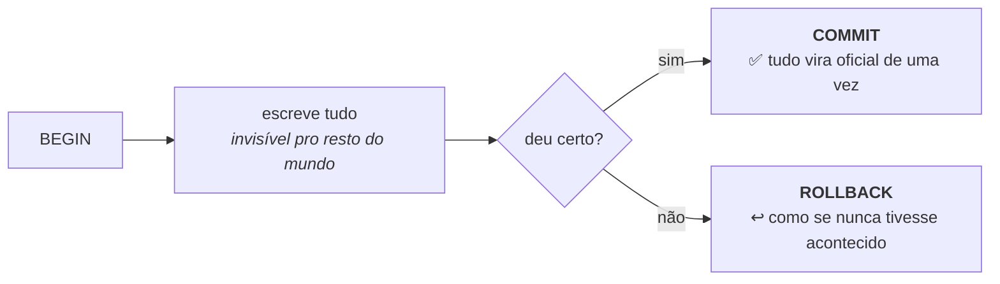
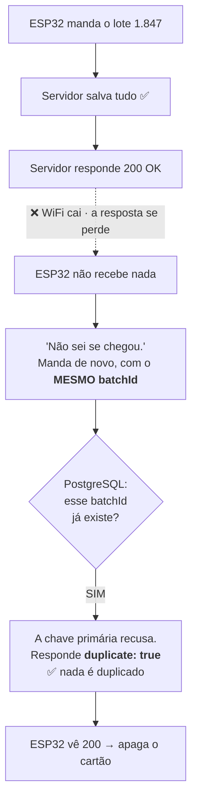
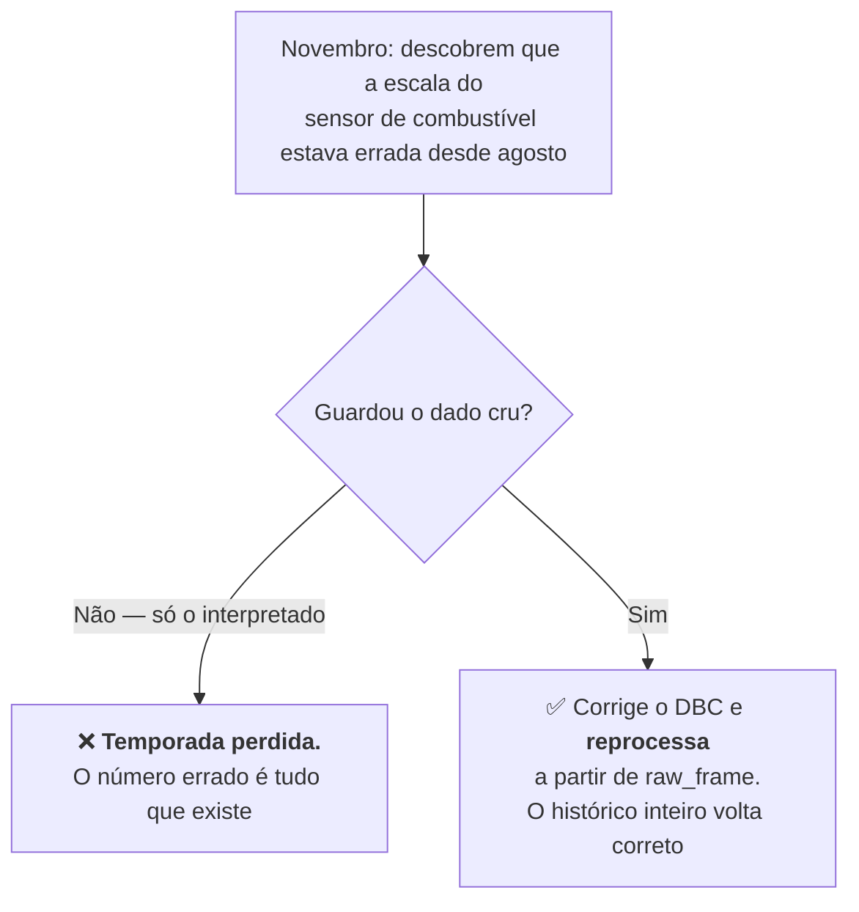
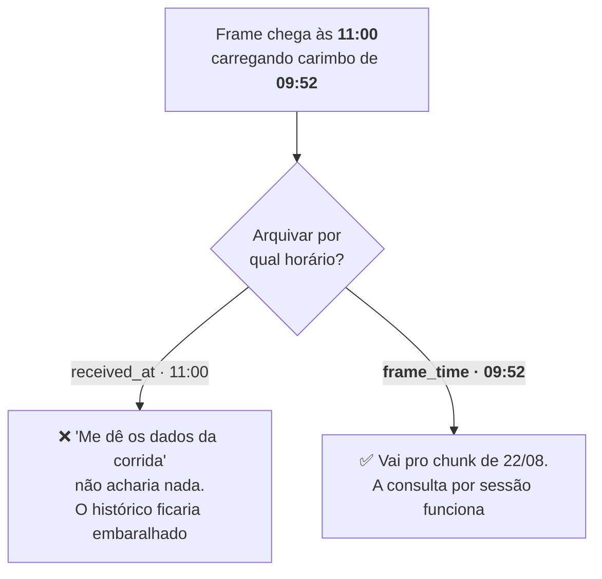

# 13 · O caminho de um lote

**O documento visual do projeto** — como as peças trabalham juntas.

> Nunca mexeu com backend? Comece pelo [`docs/14`](14-entendendo-o-projeto.md), que explica
> **o que é cada peça** antes de mostrar elas em movimento.

Acompanha um único lote de dados da leitura no barramento CAN até o ESP32 apagar o cartão —
que é, no fim, tudo que o sistema faz:

> O ESP32 gravou dados no cartão → voltou pro box → mandou pro servidor → o servidor guardou o
> **cru** → tentou interpretar → guardou os resultados → confirmou pro ESP32 → o ESP32 apagou o
> que já foi enviado.

---

## 1. O mapa completo

São **11:00:04** de sábado. O carro voltou ao box, o WiFi reconectou, e o firmware está
despejando o cartão. Este é o lote **1.847 de 3.600**.



E repete **3.600 vezes**.

---

## 2. O que é um "lote"

Mandar um POST por frame seria 500 requisições HTTP por segundo, cada uma com mais overhead que
o dado que carrega — e nenhuma entregue enquanto o carro estiver na pista. Então o ESP32 junta:

```
Lote 1.847  (1.000 frames, lidos entre 09:52:14 e 09:52:16)
├── frame 1     09:52:14.002 · canId 256 · A1B203FF
├── frame 2     09:52:14.004 · canId 512 · 7132000000000000
├── frame 3     09:52:14.006 · canId 256 · A2B204FF
├── ...
└── frame 1000  09:52:16.000 · canId 768 · F695FF10E375C190
```

Vira um JSON de ~62 KB:

```json
{
  "batchId":   "550e8400-e29b-41d4-a716-446655440000",
  "deviceId":  "esp32-node-1",
  "sessionId": "2026-08-22-teste-suspensao",
  "frames": [
    { "t": 1755865934002, "id": 256, "data": "A1B203FF" },
    { "t": 1755865934004, "id": 512, "data": "7132000000000000" }
  ]
}
```

> **Por que o `batchId` é um UUID e não `1847`?** Porque o ESP32 gera offline, sem falar com
> ninguém. Um contador simples colidiria com o de outro nó, ou reiniciaria do zero junto com a
> placa. Pelo mesmo motivo o `sessionId` é o slug `2026-08-22-teste-suspensao` — legível, e
> gerável sem rede ([ADR-007](02-decisoes-tecnicas.md)).

---

## 3. Onde cada coisa fisicamente está

Duas máquinas — e o servidor roda **dois programas separados**, que conversam por rede mesmo
estando lado a lado.



| Pergunta | Resposta |
|---|---|
| Onde o `raw_frame` fica guardado? | **Dentro do Postgres**, em disco. O cartão SD é buffer, apagado depois do 200 |
| Onde o `FrameDecoder` roda? | **Dentro da JVM**, na RAM, na CPU do servidor |
| O decodificador fala com o banco? | **Nunca.** Entra byte, sai número. É uma conta |

---

## 4. Os quatro momentos que decidem tudo

### 4.1 A transação — tudo ou nada

Gravar 1.000 frames e falhar no 700º deixaria um lote pela metade, e ninguém saberia quais 300
faltam. A transação elimina esse estado.



É a mesma garantia de uma compra no cartão: ou o dinheiro sai **e** a compra é registrada, ou
nenhum dos dois.

### 4.2 A idempotência — o que acontece quando o WiFi cai na hora errada

O caso perigoso não é o envio falhar. É o envio **dar certo e a resposta se perder**:



**A proteção mora no banco, não no código.** Um `if (jaExiste)` teria uma fresta: duas
requisições simultâneas perguntam "existe?", as duas ouvem "não", as duas gravam. Uma chave
primária não tem essa fresta.

> ⚠️ **Requisito de firmware:** o `batchId` precisa ser gravado no cartão SD junto com o buffer.
> Se o ESP32 reiniciar e gerar um id novo para os mesmos frames, essa proteção não reconhece nada
> e o dado duplica ([ADR-008](02-decisoes-tecnicas.md)).

### 4.3 O cru antes do interpretado

O `raw_frame` é gravado **antes** de qualquer tentativa de interpretação. Não é ordem arbitrária:



Por isso o cru é **imutável e nunca apagado**, enquanto os sinais decodificados são tratados como
**descartáveis e reconstruíveis** ([ADR-001](02-decisoes-tecnicas.md)). É o contrário do
instinto, que mandaria apagar justamente a tabela maior.

### 4.4 O carimbo que decide a gaveta

Os dados **chegaram** às 11:00, mas foram **produzidos** às 09:52. O banco arquiva pelo segundo:



Um **chunk** é a gaveta onde o TimescaleDB arquiva as linhas de uma janela de tempo — no nosso
caso, um dia. O ESP32 nunca ouve falar em chunk: ele é escolhido **por linha, no servidor, na
hora do INSERT** ([`docs/06 §8`](06-modelo-de-dados.md)).

---

## 5. Os seis personagens

| | Personagem | Papel | O que ele **não** sabe |
|---|---|---|---|
| 🏎️ | **ESP32** | Coleta do CAN, bufferiza no SD, envia em lotes | que existe banco, chunk ou Spring |
| 🚪 | **Tomcat** | O porteiro: recebe bytes numa porta | o que é Baja, CAN ou RPM |
| 🧑‍💼 | **Controller** | O recepcionista: confere se a mensagem está bem **formada** | se o `canId` existe no DBC |
| 👨‍💼 | **Service** | O gerente: coordena a transação inteira | como os bits viram grandeza |
| 🧠 | **FrameDecoder + DBC** | O tradutor: bytes → grandeza física | que existe HTTP, banco ou Spring |
| 🗄️ | **PostgreSQL** | O arquivo: guarda e garante que nada duplique | de onde os dados vieram |

**Essa ignorância mútua é o projeto funcionando.** É ela que permite trocar uma peça sem encostar
nas outras — e que deixa o decodificador testável com dez mil casos aleatórios em milissegundos,
sem subir servidor nenhum.

---

## 6. A filosofia, em uma frase

> **Nunca perca o dado original. Nunca processe o mesmo lote duas vezes. E só mande o ESP32
> apagar o cartão depois que o servidor confirmar que está tudo salvo.**

Cada uma dessas três metades vira uma decisão registrada: [ADR-001](02-decisoes-tecnicas.md)
(cru e decodificado), [ADR-008](02-decisoes-tecnicas.md) (idempotência por lote) e
[ADR-004](02-decisoes-tecnicas.md) (ingestão em lote, com confirmação).

---

**Para ir mais fundo:** [`docs/07`](07-arquitetura-do-codigo.md) tem a mesma história em prosa,
com a estrutura de pacotes. [`docs/06`](06-modelo-de-dados.md) tem o schema e os números medidos.
[`docs/08`](08-contrato-de-erros.md) tem o que acontece quando dá errado.
