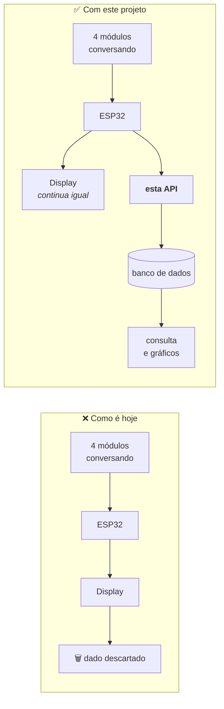
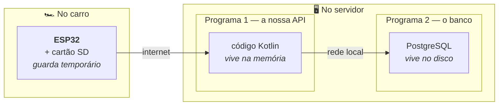
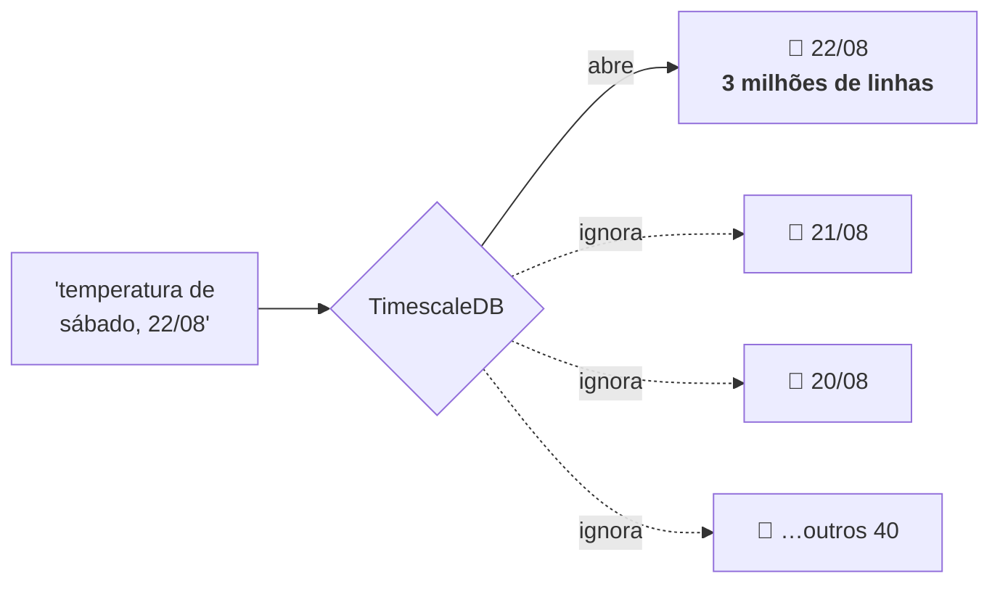
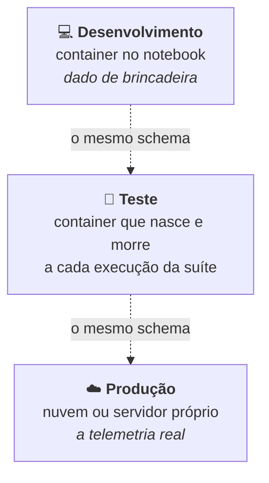
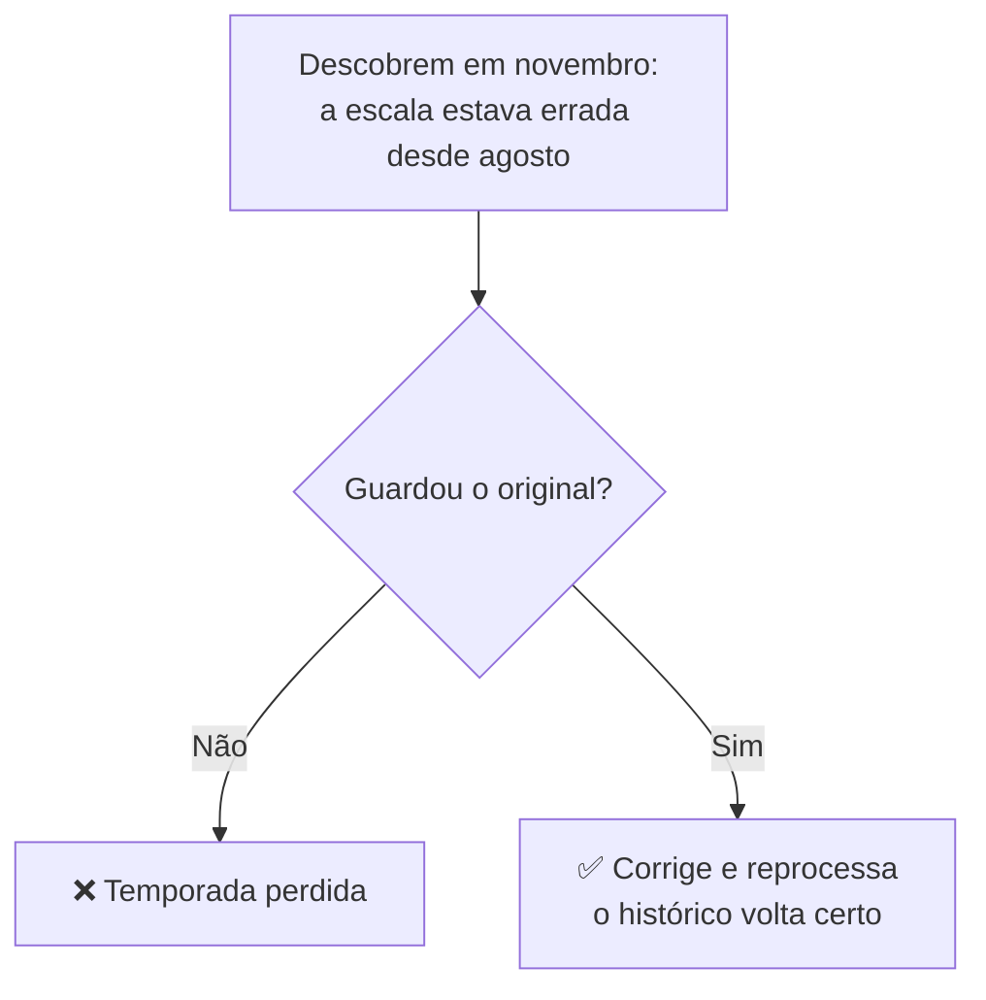

# 14 · Entendendo o projeto do zero

**Para quem nunca mexeu com backend.** Se você é da mecânica, do time de eletrônica, ou está
entrando na equipe agora, comece por aqui. Nada é assumido como sabido.

O [`docs/13`](13-o-caminho-de-um-lote.md) mostra **como as peças trabalham juntas**.
Este arquivo explica **o que é cada peça e por que ela está aqui**.

---

## 1. O problema, sem jargão nenhum

O carro tem quatro módulos eletrônicos que conversam entre si por um fio — velocidade, RPM,
temperatura do motor, combustível, GPS. Um ESP32 escuta essa conversa e mostra num display para
o piloto.

**E acabou.** Quando o carro volta pro box, tudo que passou por ali sumiu.

Aí ninguém consegue responder:

- Em qual volta a temperatura passou de 100 °C?
- O RPM caiu naquela curva, ou foi impressão do piloto?
- O consumo de hoje foi melhor que o da semana passada?



**Este projeto é só o bloco novo.** Nada do que já existe no carro muda.

---

## 2. O que a API faz, em quatro etapas

**Recebe.** O ESP32 manda pacotes de dados pela internet quando tem WiFi.

**Guarda o original.** Antes de tentar entender qualquer coisa, salva exatamente o que chegou.

**Traduz.** Os dados chegam como bytes sem significado. A API converte em "4.000 rpm", "51 °C".

**Devolve.** Alguém pergunta "qual foi a temperatura máxima na prova de sábado?" e recebe a resposta.

A ordem importa e não é acidental — a etapa 2 vem antes da 3 de propósito. Volto nisso na seção 7.

---

## 3. Onde as coisas ficam, fisicamente

A confusão mais comum é achar que tudo roda no mesmo lugar. São **duas máquinas**, e o servidor
roda **dois programas separados** que conversam entre si.



| Onde | O que faz | O que ele **não** sabe |
|---|---|---|
| **ESP32** | Lê do carro, guarda no cartão, envia quando dá | que existe banco de dados |
| **API** | Recebe, traduz, manda guardar | como os dados foram lidos |
| **Banco** | Guarda e devolve quando perguntam | de onde os dados vieram |

Cada um ignora os outros de propósito. É isso que permite trocar uma peça sem quebrar as outras.

---

## 4. As ferramentas, uma por uma

Cada uma existe para resolver um problema específico. Nenhuma está aí por moda.

### Kotlin e a JVM

**Kotlin** é a linguagem em que o código é escrito. **JVM** é o programa que executa esse código
— como o ESP32 executa o firmware, a JVM executa o Kotlin.

**Por que Kotlin:** ela obriga você a dizer quais valores podem estar vazios. Se você esquecer de
tratar um caso vazio, o código **não compila**. É o erro mais comum em backend, e a linguagem
elimina ele antes de rodar.

### Spring Boot

Um **framework** — um conjunto de peças prontas para não reescrever o básico. Ele cuida de
receber requisições da internet, conversar com banco, e organizar o código.

Sem ele, você escreveria do zero como abrir uma porta de rede, interpretar HTTP e gerenciar
conexões. Com ele, você declara o que quer e ele monta.

> **A parte estranha:** o Spring liga funcionalidades sozinho, baseado no que ele encontra no
> projeto. A gente não escreveu nenhum código de "checar se está vivo", mas
> `/actuator/health` funciona — só porque a biblioteca está declarada. Isso assusta no começo.

### Gradle e o wrapper

**Gradle** é o `platformio.ini` do mundo Java. Um arquivo lista de que bibliotecas o projeto
precisa e em que versão; ele baixa, compila e empacota.

**O wrapper** (`./gradlew`) resolve a dor que todo mundo do embarcado conhece: toolchain de
versão diferente compilando o mesmo código e dando resultado diferente. Em vez de cada um
instalar o Gradle, o repositório carrega um script que **baixa a versão certa sozinho**. Quem
clonar compila igual, sem instalar nada.

### Docker e o Compose

**Docker** empacota um programa junto de tudo que ele precisa, numa caixa fechada. Você não
"instala PostgreSQL" — você roda a caixa que já tem PostgreSQL dentro, na versão exata.

**Compose** é essa caixa descrita num arquivo versionado. `docker compose up -d` e o banco sobe,
igual para todo mundo. Mesma ideia do wrapper: travar o ambiente dentro do repositório.

### PostgreSQL

O banco de dados. É onde a telemetria fica guardada de verdade, em disco.

### TimescaleDB — e por que não é "outro banco"

É uma **extensão** do PostgreSQL. Uma linha (`CREATE EXTENSION timescaledb`) e o Postgres ganha
habilidades novas. Continua sendo Postgres, mesmas ferramentas, mesma linguagem.

O que ele resolve: uma prova de 4 horas gera **18 milhões de linhas**. Perguntar "qual foi a
temperatura máxima?" numa tabela desse tamanho é lento.

**A ideia é a gaveta de cadernos.** Em vez de um caderno gigante com a temporada inteira, um
caderno por dia numa gaveta. Pergunta sobre sábado → pega um caderno, ignora o resto.



Cada caderninho desses se chama **chunk**, e o TimescaleDB cria e escolhe sozinho.

**O agregado contínuo** é o passo seguinte. Se alguém pede "média de RPM por segundo na prova
inteira", o banco teria que ler 3 milhões de leituras e agrupar — 7 segundos, toda vez que
alguém abre o gráfico. Mas a prova já acabou: aquelas médias nunca mais mudam.

Então ele calcula **uma vez**, guarda o resultado, e depois só lê o resultado pronto. Medido
neste projeto: de **6.899 ms para 3,8 ms**.

É o quadro branco do box — ninguém reassiste 4 horas de vídeo pra saber a volta mais rápida.
Alguém calculou uma vez e escreveu lá.

### Flyway

Toda mudança no formato do banco (criar tabela, adicionar coluna) vira um arquivo numerado,
guardado no git, aplicado em ordem. O banco tem histórico versionado, igual ao código.

A alternativa seria deixar o framework alterar tabela sozinho — o que funciona até o dia em que
ele apaga uma coluna que tinha dado dentro.

### Testcontainers

Nos testes automáticos, sobe **um PostgreSQL de verdade** num container, roda os testes, e
destrói no fim.

A alternativa comum é um banco falso e leve que roda na memória. Foi descartada porque banco
falso mente: ele não tem TimescaleDB, não tem as mesmas funções, e não se comporta igual. Um
teste que passa no falso e quebra em produção é rotina — e teste que dá falsa confiança é pior
que teste nenhum, porque desliga a desconfiança.

---

## 5. Os dois conceitos do carro que viram problema de backend

### O dado que chega não se explica

Quando você recebe um JSON de uma API normal, ele se autodescreve:

```json
{ "rpm": 4000 }
```

Do CAN chega isto:

```
ID: 0x100    Dados: 3E 80 5B 00 00 00 00 00
```

**Oito bytes, sem nome de campo, sem nada.** O significado não está no dado — está numa tabela
combinada de antemão entre quem envia e quem recebe.

Essa tabela existe hoje, mas escrita em C dentro do firmware. O projeto tira ela de lá e põe num
arquivo que todo mundo lê: o **DBC**. Detalhes em [`docs/05`](05-mapa-de-sinais.md).

### A ordem dos bytes é uma convenção

Um número maior que 255 não cabe num byte, então usa dois. Aí aparece a pergunta: **qual byte vem
primeiro?**

Pensa em número decimal. "Mil duzentos e trinta e quatro" a gente escreve `1234`. Dava pra ter
convencionado `4321`, unidades primeiro. Nenhum é errado — só precisa que os dois lados combinem.

Com bytes é igual, e tem nome: **big endian** (o pesado primeiro) e **little endian** (o leve
primeiro).

**Por que isso é perigoso aqui:**

| Os mesmos bytes `3E 80` | Lidos como |
|---|---|
| big endian | **4.000 rpm** |
| little endian | 8.207,5 rpm |

Os dois são números perfeitamente válidos. **Nenhum erro é levantado.** E o CRC do frame CAN não
salva — ele garante que os bytes chegaram intactos, não que você os interpretou certo. Não existe
checksum para "sentido".

Foi por isso que este projeto tem um checklist só pra revisar o tradutor
([`revisar-decodificador`](../.claude/skills/revisar-decodificador/SKILL.md)).

---

## 6. Os três bancos de dados

Confusão comum: "o banco fica na nuvem ou no computador?". **Depende de qual dos três.**



| Qual | Onde | Para quê | Situação |
|---|---|---|---|
| Desenvolvimento | Container no notebook | Programar no dia a dia | ✅ funcionando |
| Teste | Container efêmero | Rodar a suíte automática | checkpoint 1.4 |
| **Produção** | **ainda não decidido** | Guardar a telemetria de verdade | Fase 5 |

**Por que a produção ainda não foi decidida:** o TimescaleDB é uma extensão, e nem todo serviço
de banco na nuvem permite instalar extensão. Muitos oferecem "PostgreSQL" com uma lista fechada.
Isso precisa ser verificado antes da Fase 5, e está registrado como pendência.

Se nenhum servir, há dois planos B já previstos: hospedar o banco num servidor próprio (com o
mesmo arquivo do Compose), ou abrir mão do TimescaleDB e fazer o fatiamento na mão.

**Nada do que já foi escrito depende dessa decisão.** O código fala com "um PostgreSQL", e trocar
o endereço é configuração.

---

## 7. As três regras que explicam quase toda decisão

Se você entender estas três, entende o porquê da maioria das escolhas do projeto.

### Nunca perca o original

O dado cru é gravado **antes** de qualquer tentativa de tradução, e nunca é apagado.

Por quê: se em novembro alguém descobrir que a escala de um sensor estava errada desde agosto, e
só existir o valor traduzido, **a temporada está perdida**. Com o original guardado, corrige a
tabela e traduz tudo de novo.



Consequência que surpreende: o original é a tabela **maior**, e mesmo assim é a que nunca se
apaga. A traduzida, que também é grande, pode ser jogada fora e refeita.

### Nunca processe o mesmo pacote duas vezes

O WiFi cai bem na hora em que o servidor responde "recebi". O ESP32 não sabe se chegou, então
manda de novo. Sem proteção, meio dia de dados duplica — e dado duplicado **não dá erro**: dá
média errada, num gráfico que parece normal.

Cada pacote leva um número de identificação único, e o banco recusa o mesmo número duas vezes.
A proteção mora no banco, não numa checagem no código — porque duas requisições ao mesmo tempo
enganariam a checagem, mas não enganam o banco.

### Só mande apagar depois de ter guardado

O ESP32 tem espaço limitado no cartão. Ele apaga o que já enviou — mas **só quando o servidor
confirma**. Se apagar antes, e o servidor não tinha guardado, o dado sumiu para sempre.

É por isso que toda resposta de erro da API carrega um campo dizendo se vale a pena tentar de
novo. Sem ele, o firmware teria que adivinhar.

---

## 8. Onde ler mais

| Quer entender | Leia |
|---|---|
| Como as peças trabalham juntas, do cartão SD ao banco | [`docs/13`](13-o-caminho-de-um-lote.md) |
| O que é DBC e como ler uma linha dele | [`docs/05`](05-mapa-de-sinais.md) |
| Um termo específico que apareceu | [`docs/04`](04-glossario.md) |
| **Por que** cada decisão foi tomada, com as alternativas | [`docs/02`](02-decisoes-tecnicas.md) |
| Em que ponto o projeto está e o que vem depois | [`docs/00`](00-estado-atual.md) e [`docs/12`](12-plano-de-fases.md) |
| Como rodar na sua máquina | [`docs/11`](11-ambiente-e-setup.md) |
